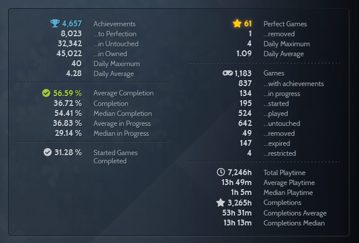

# Completionist Scraper

Scrapes completionist.me for a profile's stats...



...as a json object:

```json
{
  "Achievements": "4,657",
  "Achievements in Owned": "45,022",
  "Achievements in Untouched": "32,342",
  "Achievements to Perfection": "8,023",
  "Average Completion": "56.59 %",
  "Average Playtime": "13h 49m",
  "Average in Progress": "36.83 %",
  "Completion": "36.72 %",
  "Completions": "3,265h",
  "Completions Average": "53h 31m",
  "Completions Median": "13h 13m",
  "Daily Average": "4.28",
  "Daily Average Perfect Games": "1.09",
  "Daily Maximum": "40",
  "Daily Maximum Perfect Games": "4",
  "Games": "1,183",
  "Games Expired": "147",
  "Games Played": "524",
  "Games Removed": "49",
  "Games Restricted": "4",
  "Games Started": "195",
  "Games Untouched": "642",
  "Games in Progress": "134",
  "Games with Achievements": "837",
  "Median Completion": "54.41 %",
  "Median Playtime": "1h 5m",
  "Median in Progress": "29.14 %",
  "Perfect Games": "61",
  "Removed Perfect Games": "1",
  "Started Games Completed": "31.28 %",
  "Total Playtime": "7,246h"
}
```

## Install

Dependencies: [Go](https://go.dev/doc/install)

```bash
go install github.com/zachgharst/completionist_scraper
```

## Usage

```bash
completionist_scraper [--help | −h] [-f output file] <steam id>
```

